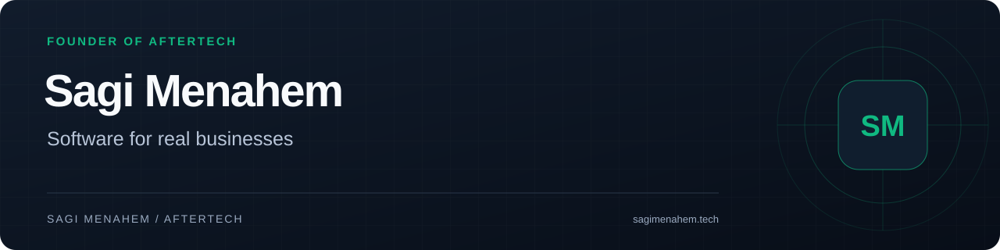

# Sagi Menahem

**Founder of AfterTech · Independent Software Developer**

I build websites and custom software for businesses in Israel through [AfterTech](https://www.after-tech.co.il/). Clients work directly with me, from requirements and architecture to implementation, launch and ongoing maintenance.

[AfterTech](https://www.after-tech.co.il/) · [Personal portfolio](https://www.sagimenahem.tech/) · [LinkedIn](https://www.linkedin.com/in/sagi-menahem/) · [Get in touch](mailto:sagiia1997@gmail.com)

## Selected work

### [AfterTech Portal](https://github.com/sagi-menahem/AfterTech-Portal)
**Business product · Client operations & AI support**

A client portal with a Hebrew-first support agent shared by web chat and WhatsApp. Hybrid retrieval and LLM re-ranking select relevant knowledge before the agent answers.

### [DelareaTickets](https://github.com/sagi-menahem/DelareaTickets)
**Client project · E-commerce**

A football ticket and travel platform with payment verification, order management and admin workflows. Built end-to-end as the sole engineer.

### [Harel Shemesh](https://github.com/sagi-menahem/Harel-Landing-Page)
**Client project · Artist portfolio & CMS**

An artist-managed website with a content system, enquiry workflows and a wall preview that displays artwork at its true physical size.

### [AfterTech](https://github.com/sagi-menahem/AfterTech)
**Business website · Services & selected work**

The public website for my software business: a Hebrew-first static site connected to the client portal for enquiries and support.

### [Synthetix](https://github.com/sagi-menahem/Synthetix)
**Independent product · Football match nights**

A mobile-first app for balancing squads, tracking live games and managing the rotation of teams during a match night.

### [SynchBoard](https://github.com/sagi-menahem/SynchBoard)
**Academic project · Public source code**

My Computer Science final project: a collaborative whiteboard and chat application built with Java, Spring Boot, React and WebSockets.

## More projects

- **Agency delivery:** [FBT Israel](https://github.com/sagi-menahem/FBT) and [Maskiled Israel](https://github.com/sagi-menahem/Maskiled-Israel) were delivered for **Agentical's clients**, as the sole engineer on those codebases.
- **Independent work:** [MasterDealer](https://github.com/sagi-menahem/MasterDealer), a real-time poker session tracker, and my [interactive 3D portfolio](https://github.com/sagi-menahem/Sagi-Menahem-Portfolio).
- **Demo:** [Insurance website](https://github.com/sagi-menahem/RV-Landing-Page), a reusable Hebrew-first template with content management.
- **Coursework:** [Assembler in C](https://github.com/sagi-menahem/Assembler-in-C), a two-pass assembler for an educational 12-bit instruction set.

Commercial and independent-product repositories are public case studies where indicated; their application source is private. SynchBoard and the assembler include source code.

## Engineering focus

My work spans e-commerce, business systems, integrations, automation, AI features and image-processing solutions. I focus on server-side validation, explicit data boundaries, tests and production monitoring.

For LLM features, I work with retrieval grounded in the product's own knowledge: vector and full-text search, re-ranking and a fallback when the available sources do not answer the question. AI-assisted development is part of my workflow, alongside code review and verification.

**Web:** TypeScript, Next.js, React, Astro, Tailwind CSS

**Data & infrastructure:** PostgreSQL, Supabase, Drizzle, Vercel, Docker

**Additional stack:** Java, Spring Boot, Three.js

## Background

I am completing a B.Sc. in Computer Science at The Open University of Israel, with expected completion in October 2026. This profile brings together client work, independent products and academic projects.
